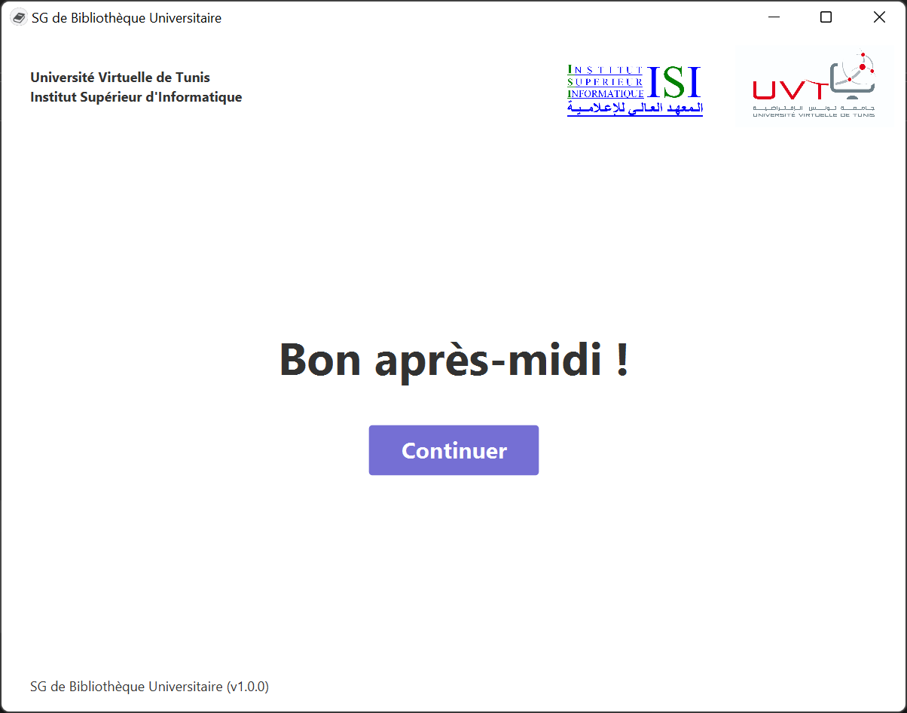
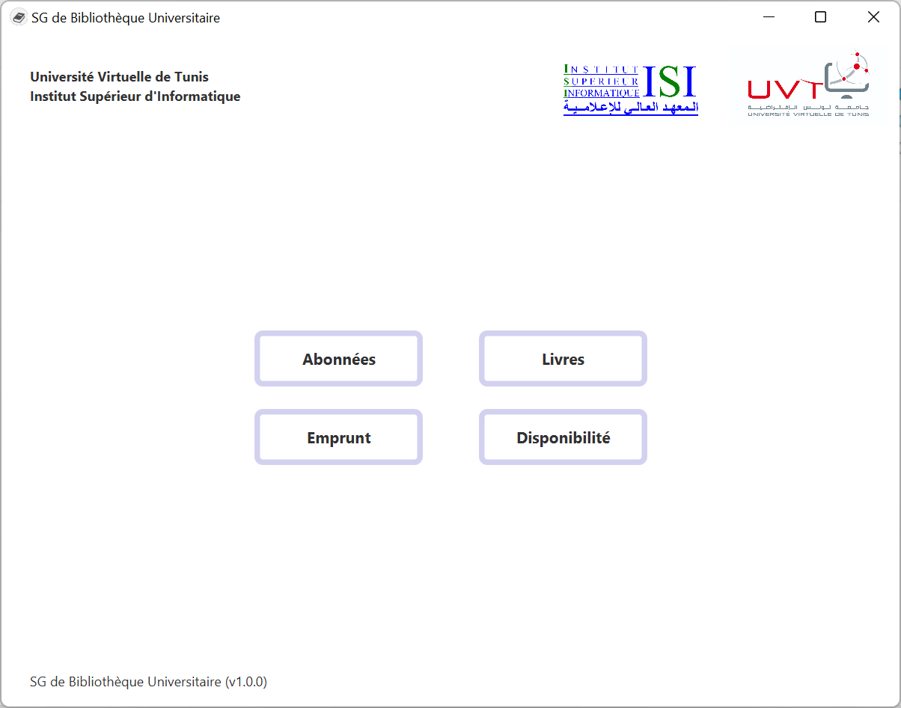
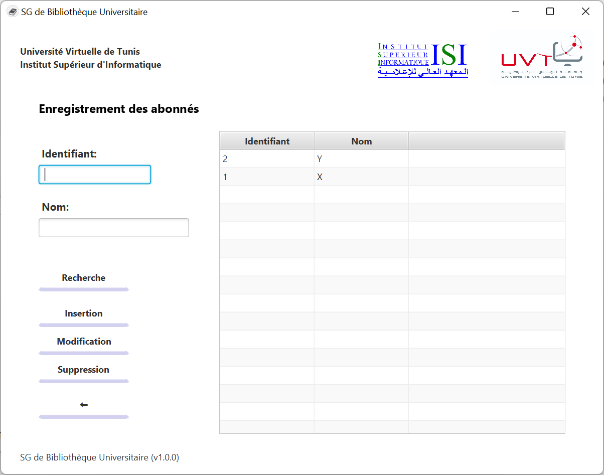
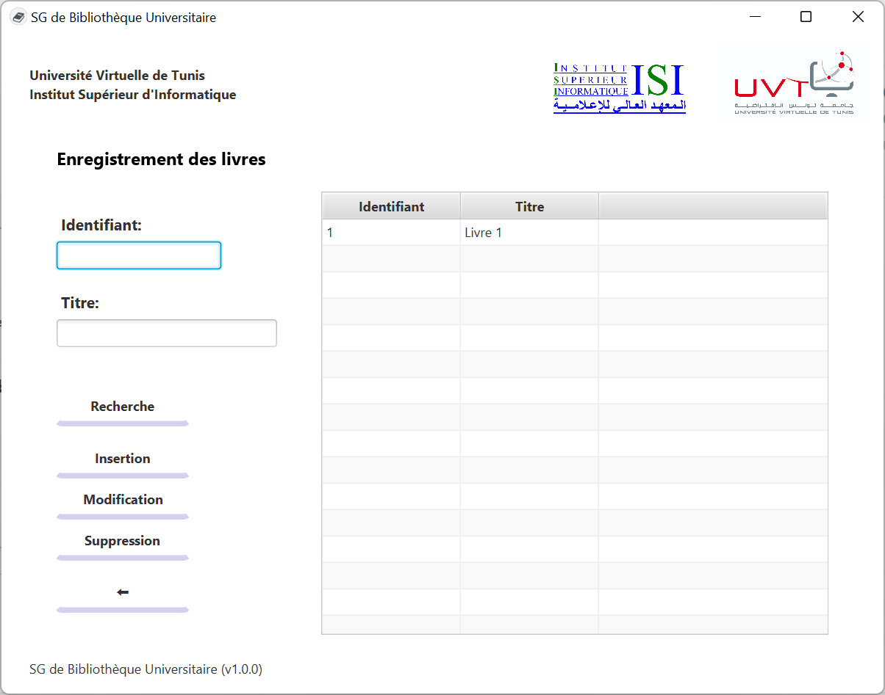
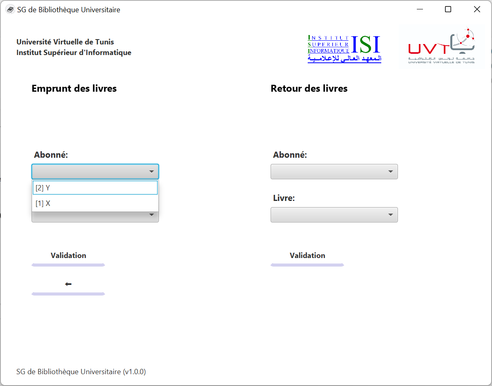
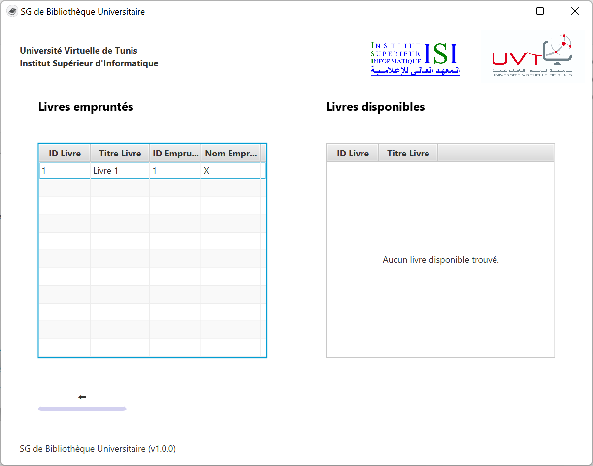

# README

## About

University Library Management System 
You can read the requirements [here](mini-projet-programmation-java.pdf).

## Notes

[JDK 11](https://www.oracle.com/java/technologies/javase/jdk11-archive-downloads.html) is required in order to run this desktop app. 

## Dev Tools

- IntelliJ IDEA
- Scene Builder
- DB Browser for SQLite

## Progress

### UI Integration

- [X] Books
- [X] Subscribers
- [X] Loan
- [X] Disponibility

### DB Operations

#### Books

- [X] Search by id or title (id, title)  // if matches any of the two, return it
- [X] Insert (title)
- [X] Update (id, title)
- [X] Delete by id or title (id, title)

#### Subscribers

- [X] Search by id and/or fullname (id, fullname)
- [X] Insert (fullname)
- [X] Update (id, fullname)
- [X] Delete by id or fullname (id, fullname)

#### Loan

- [X] Loan book (bookId, subscriberId)
- [X] Return book (bookId, subscriberId)

#### Disponibility

- [X] Get loaned books (joinSubscriber: boolean) -> bookId, bookTitle, subscriberId, subscriberFullname
- [X] Get available books () -> bookId, bookTitle

## Demo

